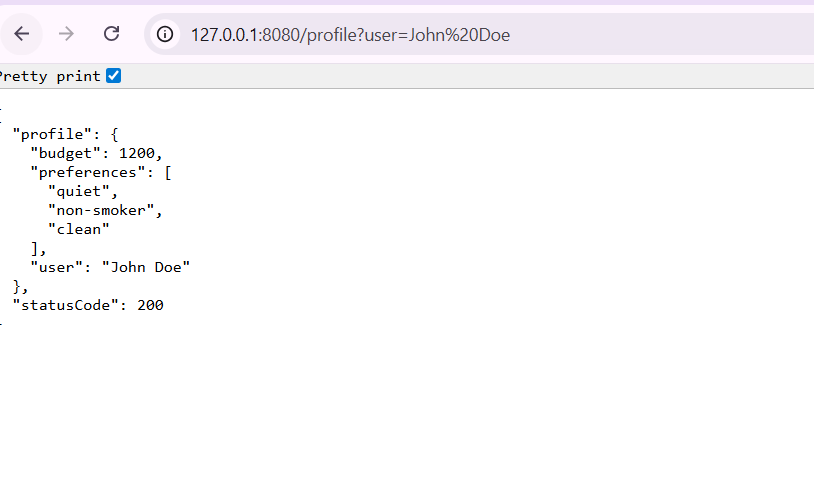
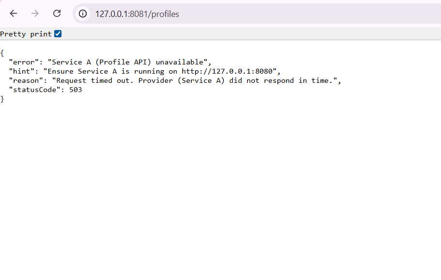

# CMPE 273 – Week 1 Lab 1: Python Track (Flask + requests)

It has services as follows: **Profile API** (Service A) and **Client** (Service B) with health, profile by name, and all profiles.

---

## Service endpoint details

| Service | Port | Endpoints |
|---------|------|-----------|
| **Service A (Profile API)** | 8080 | `GET /health` → `{"status":"ok"}` <br> `GET /profile?user=<name>` → that user's profile <br> `GET /profiles` → all 3 profiles |
| **Service B (Client)** | 8081 | `GET /health` → `{"statusCode":200,"status":"ok"}` <br> `GET /profile?user=<name>` → calls Service A, returns profile <br> `GET /profiles` → calls Service A, returns all profiles |

- **Timeout:** Service B uses a 2-second timeout when calling Service A.
- **Failure handling:** If Service A is down, Service B returns **503** with a clear `reason` (e.g. "Connection refused. Provider (Service A) is down or unreachable.", "Request timed out.") and logs the failure reason.
- **Status codes:** Responses include `statusCode` in the JSON body where applicable.

---

## How to run locally

**Requirements:** Python 3.10+, pip

### 1. Start Service A (Profile API)

Open a **first terminal**:

```bash
cd python-http/service_a
pip install -r requirements.txt
python app.py
```

Following logs will be visible:

```
Service A (Profile API) listening on http://127.0.0.1:8080
Endpoints: GET /health, GET /profile?user=<name>, GET /profiles
 * Running on http://127.0.0.1:8080
```

### 2. Start Service B (Client)

Open a **second terminal** (leave Service A running):

```bash
cd python-http/service_b
pip install -r requirements.txt
python app.py
```

Following logs will be visible:

```
Service B (Client) listening on http://127.0.0.1:8081
Endpoints: GET /health, GET /profile?user=<name>, GET /profiles
Calls Service A at http://127.0.0.1:8080 (timeout 2s)
 * Running on http://127.0.0.1:8081
```

Please find below the screenshots


---

## Success + failure proof (curl output)

### Success (both services running)

**URL:**
```bash
 "http://127.0.0.1:8081/profile?user=John%20Doe"
```

**Expected response (HTTP 200):**


**Get all profiles:**
```bash
 "http://127.0.0.1:8081/profiles"
```
**Expected response (HTTP 200):**


**Service A log example:**
```
service=ServiceA-Profile endpoint=/profile status=200 latency_ms=1.23
```

**Service B log example:**
```
service=ServiceB-Client endpoint=/profile status=200 latency_ms=5.67
```

---

### Failure (Service A stopped)

1. Stop Service A (Ctrl+C in the terminal where Service A is running).
2. Run:
   ```bash
   "http://127.0.0.1:8081/profile?user=John%20Doe"
   ```

**Expected response (HTTP 503):**


**Service B log example:**
```
[2026-02-01T...] service=ServiceB-Client endpoint=/profile failure_reason=Connection refused. Provider (Service A) is down or unreachable.
service=ServiceB-Client endpoint=/profile status=503 latency_ms=2.01
```

Service B keeps running and does not crash.

---

## What makes this distributed?

Service A and Service B run as **separate processes** and talk only over **HTTP** (no shared memory or in-process calls). Service B calls Service A at `http://127.0.0.1:8080`; each service can start, stop, or fail on its own. When Service A is down, Service B keeps running and returns 503 with a clear reason instead of crashing. That **network-based communication** and **independent failure** are what make this a small distributed system.

---

## Project Structure (Python track)

```
python-http/         # This file
├── service_a/          # Profile API (port 8080)
│   ├── app.py
│   └── requirements.txt
└── service_b/          # Client (port 8081)
    ├── app.py
    └── requirements.txt
```

**Stack:** Flask + requests (Python 3.10+).
